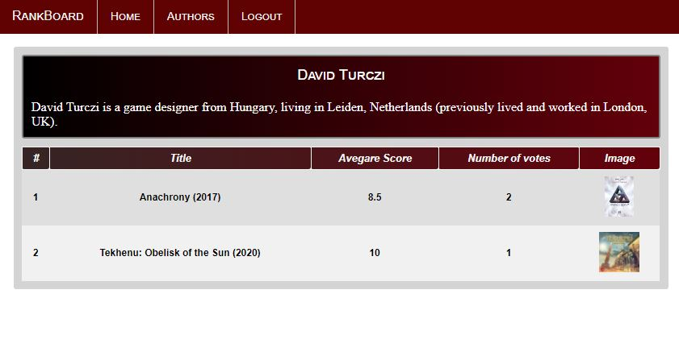

# General info

Front-end Angular application made for browsing, reviewing and scoring your favourite board games.
BoardGameGeek JSON API is used to show additional info about currently hottest games.

## Table of contents
* [Features](#features)
* [Example of use](#example-of-use)
* [Other information](#other-information)
* [TODO](#todo)
* [Development server](#development-server)

## Features
* Register and login (security with basic authentication)
* Search through board games and authors
* Learn information about board games, authors and extensions
* Write your review and score for board games
* Login as admin to edit all information or add a new admin (username: 'admin1', password: 'admin1')

## Example of use
### Register  
  
### Home page - Click on board game  
  
### Board game details and reviews  
  
### Click on 'Add a review' button to send your score and review  
  
### Authors list - click on author row to find more details  
  
### Author description and list of games he made  
  
### Sign in as admin to edit all information or add a new admin (username: 'admin1', password: 'admin1  
  

## Other information
This app was inspired by https://boardgamegeek.com/.
It is still being developed and new features will be added.
Generated with [Angular CLI](https://github.com/angular/angular-cli) version 9.1.7.

## TODO
* user can delete his reviews
* add confilct (409) warning

## Development server

Run `ng serve` for a dev server. Navigate to `http://localhost:4200/`. The app will automatically reload if you change any of the source files.
